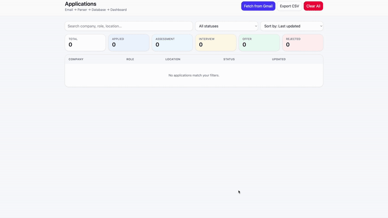

# 📧 Email Job Tracker

> [!WARNING]
> This project is under **active development**. Features may be incomplete, buggy, or subject to change. Use at your own risk.

---

## Overview

**Email Job Tracker** is a full-stack job application tracker that automatically parses your Gmail inbox for job-related emails, extracts structured application data using LLMs, and presents it in a modern dashboard UI.

- **Connect your Gmail account** with Google OAuth2
- **Fetch and store job-related emails** in a structured database
- **LLM-powered parsing** extracts company, role, status, next steps, and more from emails
- **React frontend** for a fast, modern user experience
- **Spring Boot backend** with PostgreSQL for robust data management
- **Deduplication and upsert logic** ensures no duplicate applications
- **Reset endpoint** lets you clear all your data and re-ingest from scratch

The goal: give job seekers a clean, automated dashboard—no more digging through inboxes or messy spreadsheets.

---

# Demo



---

## Project Status

### ✅ Working

- Google OAuth2 login
- Gmail API integration (read-only)
- Email fetching + persistence
- LLM-powered email parsing (OpenAI)
- Application upsert logic (deduplication + status updates)
- React frontend (Vite)
- PostgreSQL via Docker Compose
- Flyway migrations
- Entities: Users, Emails, Applications, Tasks, Contacts
- Reset endpoint (deletes all emails & applications for user)

### 🔄 In Progress

- Advanced dashboard features (filtering, analytics)
- Task management (follow-ups, interviews, etc.)
- More robust error handling and edge case coverage

### 🧠 Planned

- Google Sheets export
- Application analytics & insights
- Referral/contact management
- Multi-provider email support

---

## 🛠 Tech Stack

- **Backend:** Java 21, Spring Boot 3
- **Frontend:** React (Vite, TypeScript)
- **Database:** PostgreSQL (Dockerized)
- **Migrations:** Flyway
- **Auth & APIs:** Google OAuth2, Gmail API
- **LLM:** OpenAI (configurable)

---

## 📂 Project Structure

### Backend (`server/src/main/java/com/atakant/emailtracker`)

- `auth/` → Authentication entities & repositories (`User`, `OAuthToken`, `UserRepository`, `OAuthTokenRepository`)
- `config/` → Configuration beans (`AsyncConfig`, `GmailConfig`)
- `controller/` → Web controllers (`ApplicationController`, `DashboardController`, `HealthController`, `IngestController`)
- `domain/` → Core domain entities (`Application`, `Email`)
- `gmail/` → Gmail DTOs (`GmailMessage`)
- `repo/` → Spring Data JPA repositories (`ApplicationRepository`, `EmailRepository`)
- `security/` → Security setup (`SecurityConfig`, `CustomOAuth2SuccessHandler`)
- `service/` → Business logic (`ApplicationService`, `CandidateEmailService`, `GmailService`, `LlmClient`)
- `utils/` → Utility classes (`AppNorm`, `Hashes`, `EmailJobTrackerApplication`)

### Resources (`server/src/main/resources`)

- `db/migration/` → Flyway SQL migrations (`V1__init.sql`, `V2__add_gmail_id_internal_date.sql`, `V3__rename_due_date_add_trigger.sql`, `V4__add_is_application_column.sql`)
- `static/` → Static assets (`index.html`)
- `templates/` → Thymeleaf templates (`dashboard.html`)
- `application.yml` → Spring Boot configuration

### Frontend (`client/src`)

- `main.tsx` → React/Vite entry point and routing
- `pages/` → Main app pages (`ApplicationsDashboard.tsx`, `Login.tsx`)
- `components/` → Reusable UI components (`LoadingOverlay` etc.)

---

## 🚀 Getting Started

1. **Clone the repo**
   ```bash
   git clone https://github.com/autobot32/job-tracker.git
   cd job-tracker
   ```
2. **Run PostgreSQL via Docker**
   ```bash
   docker-compose up -d
   ```
3. **Configure Google Console and OAuth2**
   - Set up a project in [Google Cloud Console](https://console.cloud.google.com)
   - Enable the **Gmail API**
   - Configure the **OAuth consent screen**
   - Create OAuth2 credentials (Client ID & Secret)
   - Add your credentials to `application.properties` or `application.yml`
4. **Configure OpenAI API Key**
   - Add your OpenAI API key to `application.yml` (`openai.api.key`)
5. **Build and Run Backend**
   ```bash
   ./mvnw spring-boot:run
   ```
6. **Start Frontend (React)**
   ```bash
   cd client
   npm install
   npm run dev
   ```

---

## 🔄 Resetting Your Data

You can fully reset your job tracking data using the DELETE `/applications` endpoint:

- **Deletes all job applications** for the current user
- **Deletes all ingested emails** for the current user
- Ensures that future email ingests will re-process all emails as new

This operation is handled by both the `ApplicationService` and `GmailService`.

---

## API Endpoints (Backend)

- `GET /applications` — List all job applications for the current user
- `POST /applications` — Create or update a job application (ownership forced to authenticated user)
- `DELETE /applications` — Delete all applications and emails for the current user (reset)
- `POST /ingest/run-json` — Ingest emails since a given date, parse with LLM, and upsert applications
- `GET /health` — Health check
